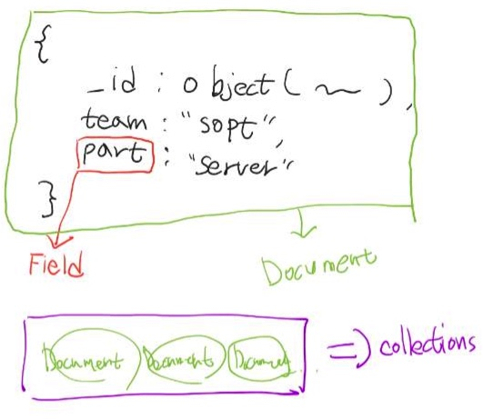
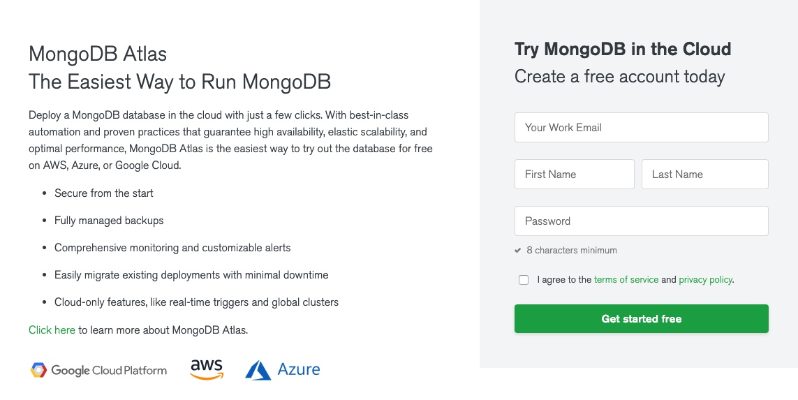
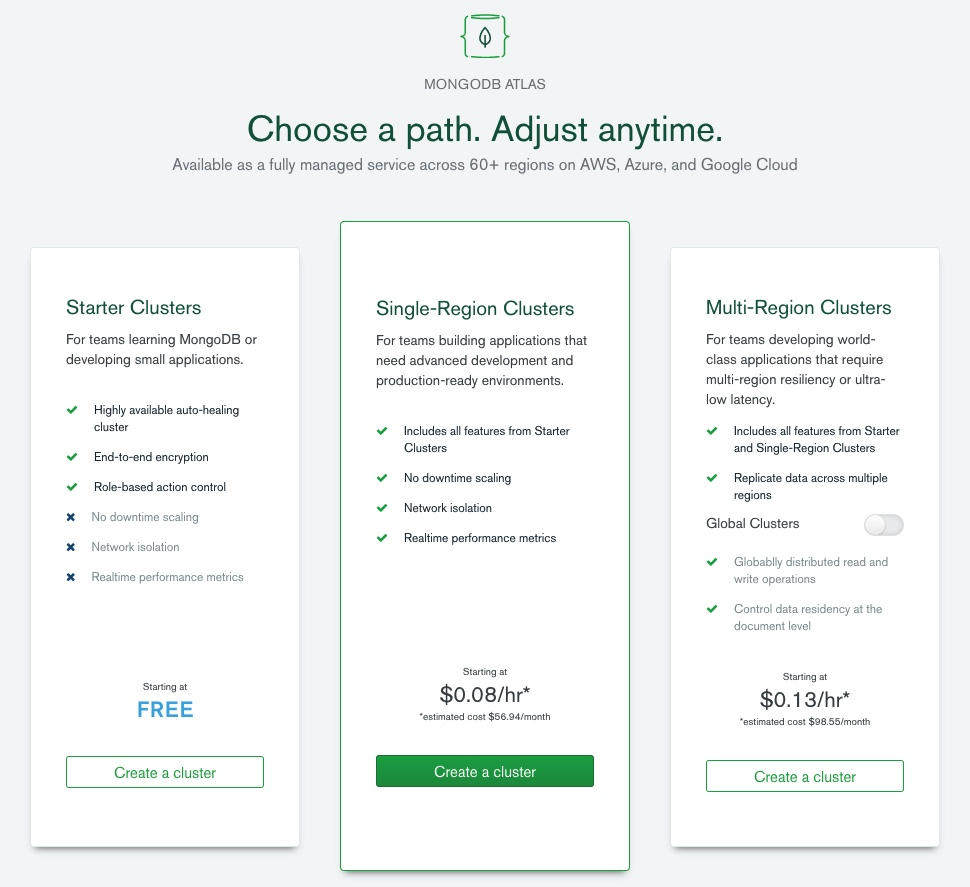
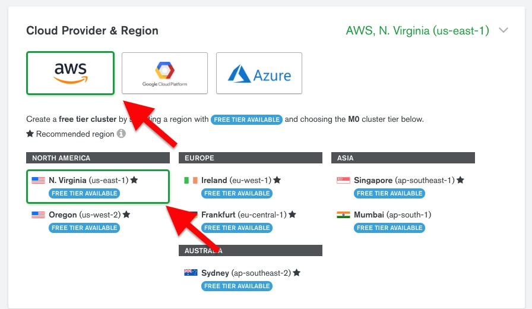
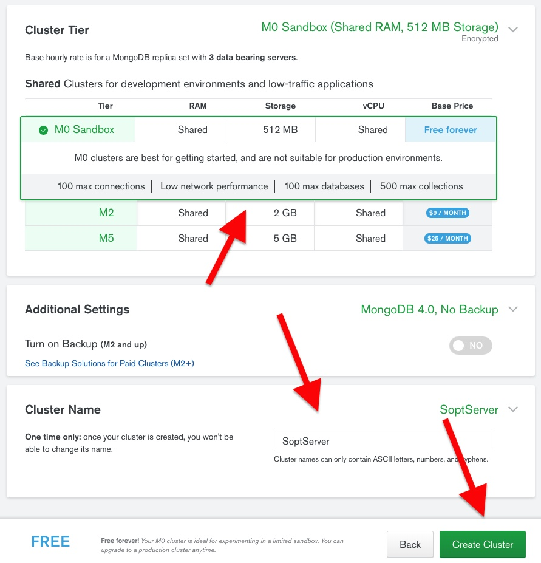
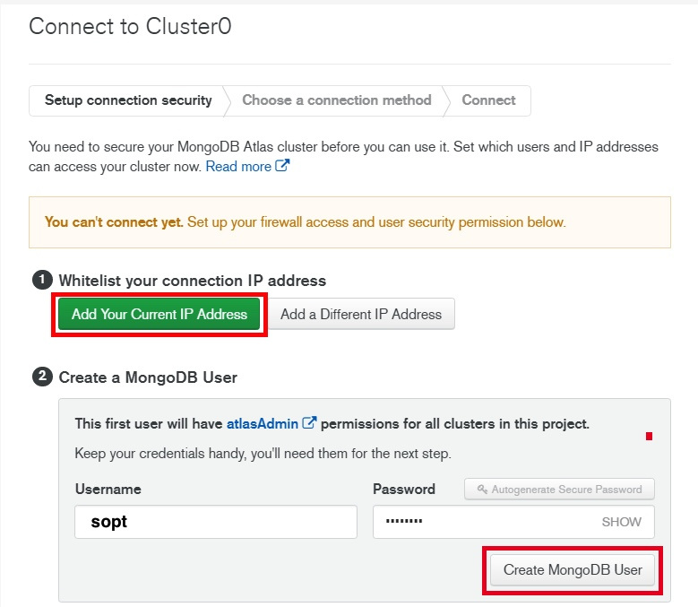
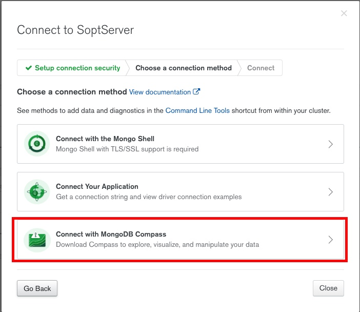
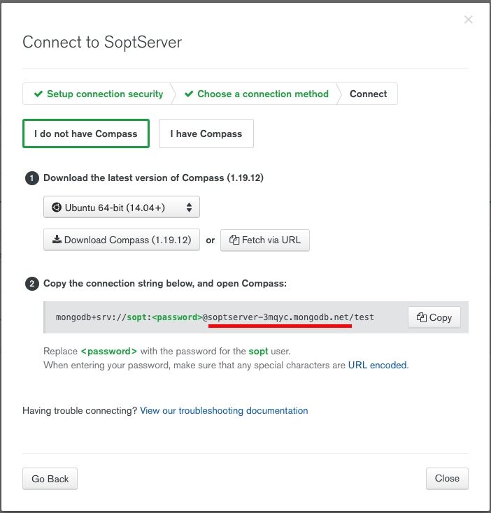
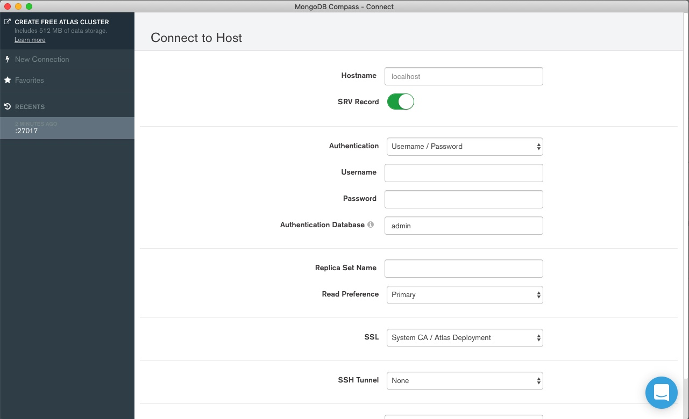
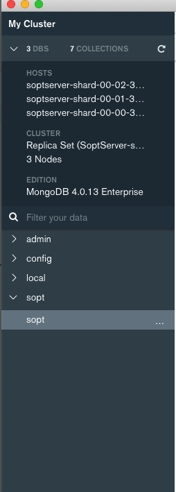

# MongoDB

## 소개

안녕하세요 sopt여러분!! 서버파트 YB 이동훈입니다! 세미나를 진행하면서 데이터베이스에 대해서 배우셨을텐데요!!

관계형 데이터베이스(RDBMS) 중 하나인 MySQL 이죠!! 하지만 이와 다른 특성을 가진 DB를 아시나요???

바로 **문서지향적**(Document-Oriented) **Schemeless**,**NoSQL** 데이터베이스인 **MongoDB**입니다!!

**NoSQL**이란 Not Only SQL의 약자로서 기존 관계형 데이터베이스의 한계를 극복하기 위한 새로운 형태의 데이터베이스입니다.

## Document

Document란 RDMS의 record와 비슷한 개념을 가지고있는데요~ 

JSON object 형태이며 key-value 쌍으로 이루어져있습니다.

Document는 다음과 같은 형태를 가집니다!!

```
{
    _id: ObjectID("121512jd21d2131221d1123"),
    team: "sopt",
    part: "server",
    name: "lee-dong-hun"
}
```
<br>
MySQL과는 사뭇 다른 형태를 띄고 있죠? 한번 표로 비교해보록 하겠습니다!!

|  <center>RDB(MySQL)</center> |  <center>MongoDB</center> | 
|:--------|:--------:|
| <center>Database </center> |<center>Database </center>|
| <center>Table </center> |<center>Collection </center>|
| <center>Tuple / Row</center> |<center>Document or BSON document </center>|
| <center>Column</center> |<center>Field</center>|
| <center>Table Join</center> |<center> Embedded Documents & Linking </center>|
| <center>Primary Key</center> |<center>Primary Key (_id)</center>|

출처 : https://poiemaweb.com/mongdb-basics

이해를 돕기위해 그림을 그려보았습니다..(발퀄 죄송합니다..)



---


# 사용해보자!!

어느정도 개념은 설명하였으니 실제로 MongoDB를 다뤄보겠습니다.

MongoDB를 쓰는 방법은 크게 두가지가 있는데

1. local환경에 설치하여 사용
2. cloud hosting(atlas)을 통해 사용

저희는 2번째 방법을 사용하겠습니다~~!! 이제 차근차근 따라와주시면 됩니다.

우선 MongoDB 호스팅을 하기위해 [Atlas페이지-https://www.mongodb.com/cloud/atlas](https://www.mongodb.com/cloud/atlas)로 이동해줍니다.


화살표를 눌러 회원가입을 진행합니다.



그럼 다음과 같이 옵션을 선택할 수 있는 화면이 나옵니다!! 저희는 Starter Clusters를 선택해줍니다~!!



그리고난 후 AWS 의 버지니아 지역을 선택한 후(지역은 FREE TIER AVAILABLE인 곳이면 상관 x)



Cluster Tier는 M0 Sandbox로, Cluster Name은 자유롭게 설정한 후 Create Cluster를 눌러줍니다.



그러면 데이터베이스를 만들어주는데요. 한 3분정도 기다리면 완료가 됩니다.


짜잔~~ 이렇게 뜬다면 호스팅은 끝났습니다. 이제 connect를 눌러줍니다.


저희는 Add your Current IP를 선택하고, Address와 User를 만들어줍니다. 그리고 Choose a connection method를 선택해줍니다.



그리고 Connect with MongoDB compass를 선택해줍니다.



마지막으로 빨간색 밑줄을 기억해 줍니다. 



이제 호스팅 설정은 다 끝났습니다~!!! 수고하셨어요~~~~ ^ㅁ^

이제 데이터베이스에 접근을 해봐야겠죠??  
**MySQL에 Workbench**가 있다면 **MongoDB에는 Compass**가 있습니다!!!

Compass를 다운받아주겠습니다. [Compass공식홈페이지](https://www.mongodb.com/download-center/compass)

다운 받은 후에 열어주면 다음과 같은 화면이 나옵니다.



이제 호스팅 서버에 접근해보겠습니다!!

HostName에 아까의 주소를, username과 password를 입력해준 후 connect를 눌러줍니다.


짠 이 화면이 나온다면 접속이 끝났습니다!!(정말 쉽죠?)  
이제 서버에서 사용할 데이터 베이스를 만들어 보겠습니다. CREATE DATABASE를 눌러줍니다.


그 후에 Database Name에 sopt, Collection Name에 sopt라고 넣어 주신후에 CREATE DATABASE를 눌러줍니다.


이런 식으로 나온다면 데이터베이스 설정은 끝!!!



---

여기까지 따라오시느라 수고하셨습니다.!!!   
다음 챕터에선 express에서 Mongoose를 통해 쿼리를 날려보는 방법에 대해 알아보겠습니다.